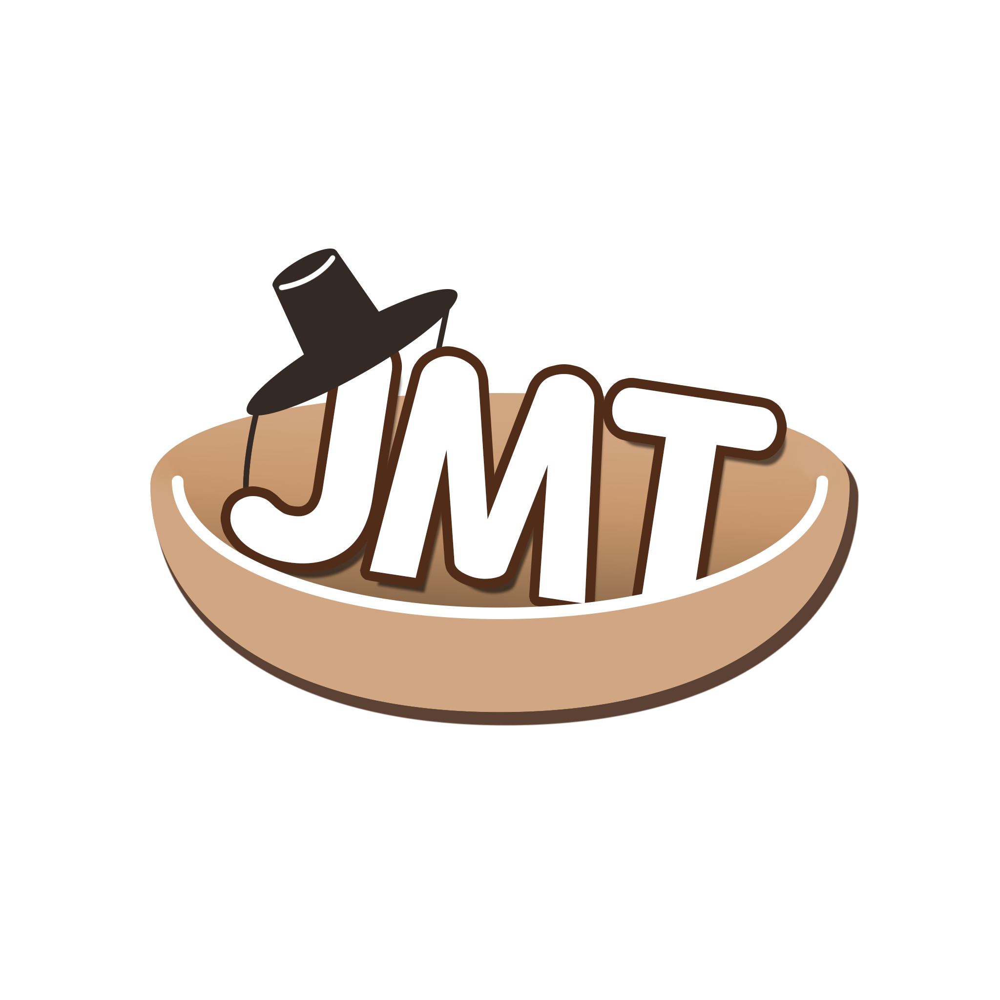

  

<h1 align="center">🎮 JMT (Joy Make Try)</h1>
<!-- 
<em>대충뭐시기멋진말</em>
 -->

  
  

<!-- --- -->

<!-- ## ✨ 팀 소개
네우리이런팀이에여우리짱멋짐 -->

---

## 👥 팀원 소개

### ⚙️ 개발
- [이상규](https://ggm.gondr.net/user/profile/223)
- [장서윤](https://ggm.gondr.net/user/profile/280)

### 🎨 아트
- [김민준](https://ggm.gondr.net/user/profile/315)
- [이정빈](https://ggm.gondr.net/user/profile/244)

### 📝 기획
- [김민혁](https://ggm.gondr.net/user/profile/281)

---

## 🎮 제작 중인 게임
### 🃏 **퇴마는 마패빨**
> 조선 곳곳에 있는 요괴들을 **마패**라는 패를 가지고 돌아다니며 봉인해나가는 덱빌딩 로그라이크 게임입니다.

  

  📺 <a href="https://www.youtube.com/watch?v=vZCT8YvepV0"><b>게임 플레이 영상 보기</b></a>

---

<!-- 

  💡 <em>"대충하고싶은말”</em>

 -->
